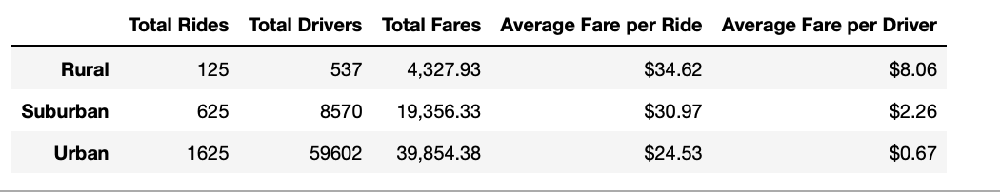

# PyBer Ride-Sharing Analysis 
## Project Overview 
Create a summary of ride-sharing data which includes insight on numbers of rides, drivers and fares for each city type 

Results 
The analysis shows that Urban cities have the largest number of rides, drivers, and highest fares, followed by the suburban then the rural. The average fare per ride shows thatrides are on average most expensive in rural cities, followed by suburban then urban cities 
.

